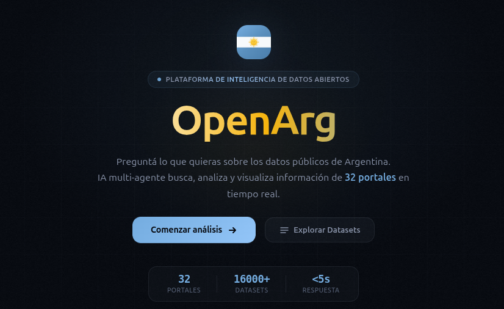
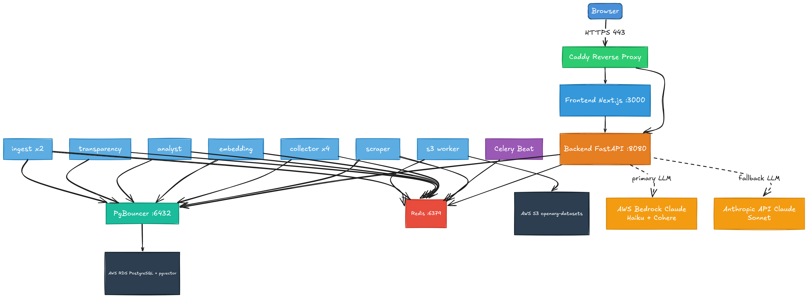
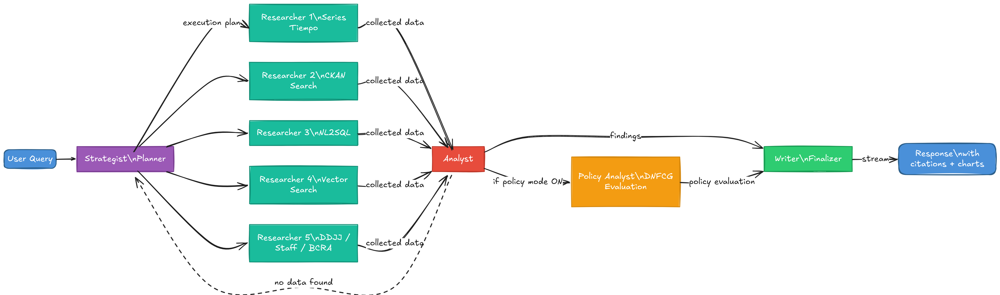
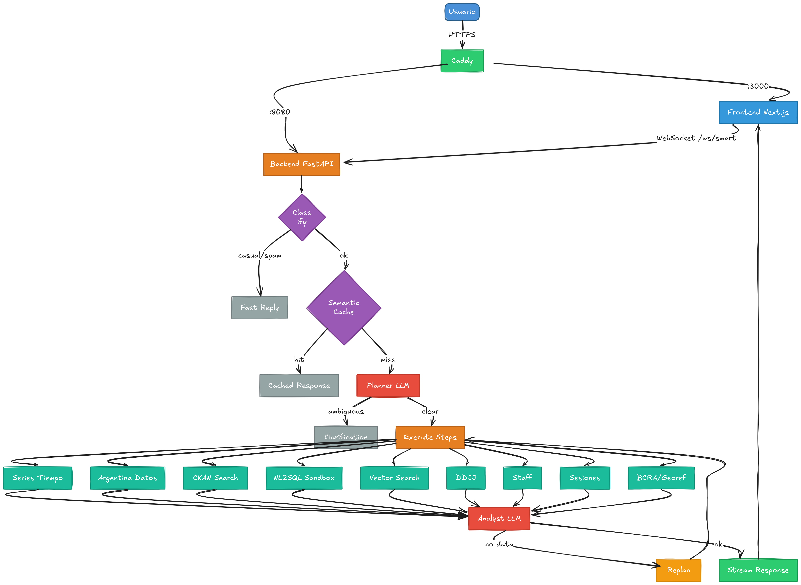

<h1 align="center">OpenArg</h1>

<p align="center">
  <b>AI-powered analysis of Argentina's open government data</b><br/>
  Ask questions in natural language. Get answers with charts, tables, and verified sources.
</p>

<p align="center">
  
</p>

<p align="center">
  
  
  
  
</p>

---

## Overview

OpenArg is an open-source platform that lets users query Argentina's public datasets through a conversational AI interface. A multi-agent pipeline plans the query, fetches data from official government APIs and CKAN portals, analyzes the results, and responds with markdown, interactive charts, and links to original sources. The frontend is a Next.js application that consumes SSE streams from a Python/FastAPI backend.

---

## Architecture

The system runs as two containerized services behind a Caddy reverse proxy on EC2: this Next.js frontend and a [FastAPI backend](https://github.com/colossus-lab/openarg_backend) with PostgreSQL (pgvector), Redis, and Celery workers.

<p align="center">
  
</p>

---

## Query Pipeline

When a user submits a question, the **backend** orchestrates a **multi-agent pipeline** and streams real-time progress to the frontend via SSE (Server-Sent Events). All agent logic runs on the backend; the frontend is a consumer that **visualizes** each agent's progress as it happens.

| Agent | Role | Visible in UI as |
|-------|------|-----------------|
| **Strategist** | Interprets the question, selects data sources, generates execution plan | "Estratega" |
| **Researchers** | Execute the plan in parallel — query APIs, run SQL, search vector indexes | "Investigadores" |
| **Analyst** | Analyze collected data, generate insights with citations and charts | "Analista" |
| **Policy Analyst** | Evaluate public policy using DNFCG criteria (pertinence, efficacy, efficiency, impact, sustainability) | "Deep Policy Analysis" toggle |
| **Writer** | Compose the final response, format markdown, suggest follow-ups | "Redactor" |

<p align="center">
  
</p>

The frontend renders each agent's activity in real-time via the `AgentActivityBar` component, showing the user which phase is active. The frontend does not run any agent logic itself — it subscribes to the backend's SSE stream and updates the UI accordingly.

<p align="center">
  
</p>

---

## Tech Stack

| Layer | Technology |
|---|---|
| Framework | Next.js 16 (App Router) |
| UI | React 19, Motion |
| Language | TypeScript 5 |
| Charts | Recharts 3, Observable Plot |
| Auth | NextAuth 4 (Google OAuth) |
| Styling | Custom CSS dark theme (glassmorphism, Argentina flag palette) |
| Internationalization | next-intl |
| Monitoring | Sentry |
| Testing | Vitest, Testing Library |
| Deploy | Docker on EC2 (GHCR images, Caddy reverse proxy) |

---

## Quick Start

### Docker (recommended)

```bash
git clone https://github.com/colossus-lab/openarg_frontend.git
cd openarg_frontend
cp .env.local.example .env.local   # fill in required values
docker build -t openarg-frontend .
docker run -p 3000:3000 --env-file .env.local openarg-frontend
```

### Local Development

```bash
git clone https://github.com/colossus-lab/openarg_frontend.git
cd openarg_frontend
npm install
cp .env.local.example .env.local   # fill in required values
npm run dev                         # http://localhost:3000
```

> **Backend required:** The frontend requires the [OpenArg Backend](https://github.com/colossus-lab/openarg_backend) running. Set `OPENARG_BACKEND_URL` to point to your backend instance.

### Environment Variables

| Variable | Description |
|---|---|
| `OPENARG_BACKEND_URL` | Backend API base URL (default: `http://localhost:8081`) |
| `OPENARG_BACKEND_API_KEY` | API key for authenticating with the backend |
| `NEXTAUTH_SECRET` | JWT signing secret (`openssl rand -base64 32`) |
| `NEXTAUTH_URL` | Auth callback URL (e.g. `http://localhost:3000`) |
| `GOOGLE_CLIENT_ID` | Google OAuth client ID |
| `GOOGLE_CLIENT_SECRET` | Google OAuth client secret |
| `ALLOWED_EMAILS` | Comma-separated list of allowed login emails |
| `ADMIN_EMAILS` | Comma-separated list of admin emails |

### Available Scripts

```bash
npm run dev          # Start dev server (port 3000)
npm run build        # Production build
npm run start        # Start production server
npm run lint         # ESLint
npm run test         # Run tests (Vitest)
npm run test:watch   # Run tests in watch mode
```

---

## Project Structure

```
src/
├── app/
│   ├── api/
│   │   ├── auth/[...nextauth]/   # NextAuth Google OAuth
│   │   ├── chat/                 # Main SSE orchestrator (POST)
│   │   ├── conversations/        # Conversation CRUD
│   │   ├── datasets/             # Dataset listing
│   │   ├── feedback/             # User feedback
│   │   ├── taxonomy/             # Data taxonomy
│   │   ├── transparency/         # Transparency endpoint
│   │   └── users/                # User sync, settings, data export
│   ├── chat/page.tsx             # Chat UI (SSE consumer)
│   ├── datasets/page.tsx         # Dataset explorer
│   ├── login/page.tsx            # Login page
│   └── layout.tsx                # Root layout
├── components/
│   ├── AgentActivityBar.tsx      # Pipeline phase visualization
│   ├── ChatMessage.tsx           # Markdown + GFM renderer
│   ├── ConversationSidebar.tsx   # Chat history sidebar
│   ├── DataChart.tsx             # Recharts wrapper (line/bar/pie)
│   ├── ObservablePlotChart.tsx   # Observable Plot charts
│   ├── SourcePanel.tsx           # Collapsible data sources
│   ├── TaxonomyExplorer.tsx      # Dataset taxonomy browser
│   └── ...                       # UI primitives, auth, dialogs
├── hooks/
│   ├── useSSEStream.ts           # SSE connection management
│   ├── useConversationState.ts   # Chat state management
│   └── useAutoResize.ts          # Textarea auto-resize
├── i18n/                         # Internationalization config
├── lib/
│   ├── authOptions.ts            # NextAuth configuration
│   ├── logger.ts                 # Structured logging
│   ├── rateLimit.ts              # API rate limiting
│   └── types.ts                  # Shared type definitions
└── middleware.ts                  # Route middleware
```

---

## Related Documentation

The backend repository contains detailed documentation on system architecture, deployment, API reference, and more:

| Document | Description |
|---|---|
| [Architecture](https://github.com/colossus-lab/openarg_backend/blob/main/docs/architecture.md) | System design and hexagonal architecture |
| [API Reference](https://github.com/colossus-lab/openarg_backend/blob/main/docs/api-reference.md) | Backend REST API endpoints |
| [Database Schema](https://github.com/colossus-lab/openarg_backend/blob/main/docs/database-schema.md) | PostgreSQL tables, pgvector indexes |
| [Deployment](https://github.com/colossus-lab/openarg_backend/blob/main/docs/deployment.md) | Docker Compose, EC2, Caddy setup |
| [Data Sources](https://github.com/colossus-lab/openarg_backend/blob/main/docs/data-sources.md) | CKAN portals, APIs, scrapers |
| [Query Pipeline](https://github.com/colossus-lab/openarg_backend/blob/main/docs/query-pipeline.md) | Multi-agent pipeline deep dive |
| [Data Ingestion](https://github.com/colossus-lab/openarg_backend/blob/main/docs/data-ingestion.md) | Celery workers, download pipeline |
| [Monitoring](https://github.com/colossus-lab/openarg_backend/blob/main/docs/monitoring.md) | Observability and health checks |
| [Security](https://github.com/colossus-lab/openarg_backend/blob/main/docs/security.md) | Auth, rate limiting, input validation |
| [Contributing](https://github.com/colossus-lab/openarg_backend/blob/main/docs/contributing.md) | Contribution guidelines |
| [Changelog](https://github.com/colossus-lab/openarg_backend/blob/main/docs/changelog.md) | Release history |

---

## Contributing

1. Fork the repository
2. Create a feature branch (`git checkout -b feature/my-feature`)
3. Commit your changes
4. Push to your branch and open a Pull Request

Please open an issue first for major changes to discuss the approach.

---

## License

[MIT](LICENSE)

---

<p align="center">
  <br/>
  Created by <b>Luciano Carreno</b> & <b>Dante De Agostino</b><br/>
  <a href="https://github.com/colossus-lab"><b>ColossusLab</b></a>
</p>
