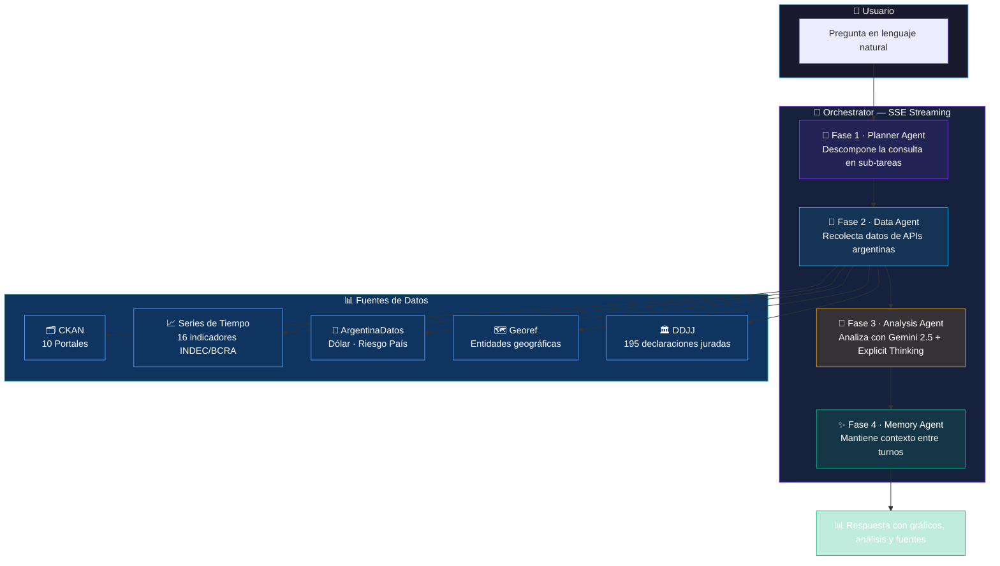

<p align="center">
  
</p>

<h1 align="center">🇦🇷 OpenArg</h1>

<p align="center">
  <b>Plataforma de Inteligencia sobre Datos Abiertos de Argentina</b><br/>
  Preguntale lo que quieras sobre datos públicos argentinos.<br/>
  OpenArg busca, analiza y te responde con gráficos y fuentes.
</p>

<p align="center">
  
  
  
  
</p>

---

## ¿Qué es OpenArg?

OpenArg es un chat con IA que se conecta en tiempo real a los datos públicos de Argentina. Escribís una pregunta en lenguaje natural y el sistema:

1. **Planifica** qué datos necesita buscar
2. **Recolecta** datos de APIs oficiales argentinas
3. **Analiza** los datos con Gemini 2.5
4. **Responde** con texto, gráficos interactivos y links a las fuentes originales

No necesitás saber de programación, APIs ni estadística. Solo preguntá.

---

## 🏗️ Arquitectura

OpenArg utiliza un pipeline de **4 agentes de IA** que trabajan en secuencia para transformar tu pregunta en un análisis completo con datos reales:



| Componente | Rol | Tecnología |
|---|---|---|
| **Planner Agent** | Interpreta la pregunta y genera un plan de ejecución en JSON | Gemini 2.5 Flash |
| **Data Agent** | Ejecuta el plan: llama APIs, descarga CSVs, consulta datastores | TypeScript + fetch |
| **Analysis Agent** | Analiza los datos recolectados, genera insights y gráficos | Gemini 2.5 + Explicit Thinking |
| **Memory Agent** | Resume hallazgos, mantiene contexto, sugiere preguntas de seguimiento | Gemini 2.5 Flash |

---

## 🚀 Guía Rápida

### Indicadores Económicos

OpenArg tiene un catálogo de **16 indicadores económicos verificados** que se actualizan automáticamente. Preguntá cosas como:

| Qué querés saber | Pregunta de ejemplo |
|---|---|
| **Inflación** | *"¿Cómo viene la inflación?"* |
| **Actividad económica** | *"¿Cómo viene el EMAE?"* |
| **Desempleo** | *"¿Cuál es la tasa de desempleo?"* |
| **Salarios** | *"Evolución de salarios en los últimos 2 años"* |
| **Tipo de cambio** | *"Cómo evolucionó el dólar oficial este año"* |
| **Dólar blue** | *"¿Cuánto vale el dólar blue?"* |
| **Riesgo país** | *"¿Cuál es el riesgo país hoy?"* |
| **Canasta básica** | *"¿Cuánto sale la canasta básica?"* |
| **Pobreza** | *"¿Cuál es la línea de indigencia?"* |
| **Presupuesto** | *"Gasto público de los últimos 10 años"* |
| **Reservas** | *"Reservas del BCRA"* |
| **Base monetaria** | *"Evolución de la base monetaria"* |
| **Comercio exterior** | *"Exportaciones vs importaciones"* |
| **Industria** | *"Actividad industrial"* |

> 💡 **Tip:** Podés pedir rangos temporales específicos: *"Inflación desde enero 2024"*, *"Desempleo de los últimos 5 años"*

> 💡 **Tip:** Podés comparar indicadores: *"Comparame exportaciones e importaciones"*, *"Inflación vs evolución de salarios"*

### Cotizaciones del Dólar

OpenArg trae cotizaciones de **7 tipos de dólar** en tiempo real:

- **Oficial** · **Blue** · **Bolsa (MEP)** · **Contado con Liqui (CCL)**
- **Cripto** · **Mayorista** · **Solidario**

```
💬 "¿Cuánto vale el dólar blue?"
💬 "Cotización del dólar cripto"
💬 "Comparame dólar oficial vs blue"
```

---

## 📊 Datos Abiertos de Todo el País

Además de los indicadores económicos, OpenArg busca en **10 portales CKAN** de datos abiertos:

| Portal | Qué tiene |
|---|---|
| 🇦🇷 **datos.gob.ar** | 1200+ datasets: economía, salud, energía, transporte, educación |
| 🏙️ **CABA** | Movilidad, presupuesto, accidentes, educación |
| 🏛️ **Buenos Aires Prov.** | Salud, género, estadísticas provinciales |
| 🏔️ **Córdoba** | Transparencia, catastro |
| 🌾 **Santa Fe** | Compras, licitaciones |
| 🍇 **Mendoza** | Presupuesto, subsidios |
| 🌊 **Entre Ríos** | ODS, comunas |
| �️ **Neuquén (Ejecutivo)** | Datos abiertos del Poder Ejecutivo provincial |
| �🏛️ **Neuquén (Legislatura)** | Datos abiertos de la Legislatura de Neuquén |
| 🏛️ **Diputados** | Legisladores, proyectos de ley, comisiones, presupuesto del Congreso |

```
💬 "¿Qué datasets de salud hay a nivel nacional?"
💬 "Mostrame los datos de transporte de CABA"
💬 "¿Qué proyectos de ley hay sobre educación?"
💬 "Listame los datasets del portal de Diputados"
```

> 💡 **Tip:** Si un dataset tiene CSV, OpenArg lo descarga y analiza automáticamente.

---

## 🏛️ Declaraciones Juradas de Diputados

OpenArg incluye **195 declaraciones juradas patrimoniales** completas de diputados nacionales (ejercicio 2024), extraídas de los PDFs de la Oficina Anticorrupción.

```
💬 "¿Cuál es el patrimonio de Cristina Kirchner?"
💬 "Top 10 diputados con mayor patrimonio"
💬 "Diputados con menor patrimonio"
💬 "Estadísticas generales de las DDJJ"
💬 "Patrimonio de [nombre del diputado/a]"
```

Datos disponibles por cada diputado:
- Patrimonio al inicio y cierre del ejercicio
- Bienes detallados: inmuebles, autos, depósitos, inversiones, efectivo
- Ingresos del trabajo y gastos personales
- Deudas y variación patrimonial

---

## 🗺️ Información Geográfica

OpenArg puede normalizar y buscar datos geográficos de Argentina:

```
💬 "Departamentos de la provincia de Buenos Aires"
💬 "Municipios de Córdoba"
💬 "Coordenadas de Rosario"
```

---

## 📈 Visualizaciones Automáticas

Cuando los datos lo ameritan, OpenArg genera automáticamente:

- **Gráficos de línea** — para series temporales (inflación, dólar, EMAE)
- **Gráficos de barras** — para comparaciones y rankings
- **Gráficos de torta** — para distribuciones y composiciones
- **Tablas** — para datos tabulares y listados

Los gráficos son interactivos: podés hacer hover para ver valores exactos.

---

## 💬 Conversación Continua

OpenArg mantiene memoria entre turnos. Podés hacer preguntas de seguimiento:

```
💬 "¿Cómo viene la inflación?"
   📊 [gráfico de inflación mensual]
   
💬 "¿Y cómo se compara con los salarios?"
   📊 [gráfico comparativo]
   
💬 "¿Qué pasó en el pico de marzo?"
   📝 [análisis contextual]
```

---

## 📎 Fuentes Verificables

Cada respuesta incluye las fuentes de datos utilizadas con links directos a los portales originales. Nada de inventar datos: OpenArg solo muestra información de APIs oficiales del gobierno argentino.

---

## Fuentes de Datos

| Fuente | Tipo | Datos |
|---|---|---|
| [datos.gob.ar](https://datos.gob.ar) | CKAN | 1200+ datasets nacionales |
| [data.buenosaires.gob.ar](https://data.buenosaires.gob.ar) | CKAN | Datos de CABA |
| [apis.datos.gob.ar/series](https://apis.datos.gob.ar/series) | API REST | 30,000+ series de tiempo (INDEC, BCRA) |
| [argentinadatos.com](https://argentinadatos.com) | API REST | Dólar blue/cripto, riesgo país |
| [apis.datos.gob.ar/georef](https://apis.datos.gob.ar/georef) | API REST | Entidades geográficas |
| [datos.entrerios.gov.ar](https://datos.entrerios.gov.ar) | CKAN | Datos de Entre Ríos |
| [portaldatosabiertos.neuquen.gov.ar](https://portaldatosabiertos.neuquen.gov.ar) | CKAN | Datos del Ejecutivo de Neuquén |
| [datos.legislaturaneuquen.gob.ar](https://datos.legislaturaneuquen.gob.ar) | CKAN | Datos de la Legislatura de Neuquén |
| [datos.hcdn.gob.ar](https://datos.hcdn.gob.ar) | CKAN | 29 datasets parlamentarios |
| Oficina Anticorrupción | Dataset local | 195 DDJJ de diputados |

---

## Licencia

MIT

---

<p align="center">
  Creado con pasión por <b>Dante De Agostino</b><br/>
  Powered by <a href="https://colossuslab.tech"><b>Colossuslab.tech</b></a>
</p>
