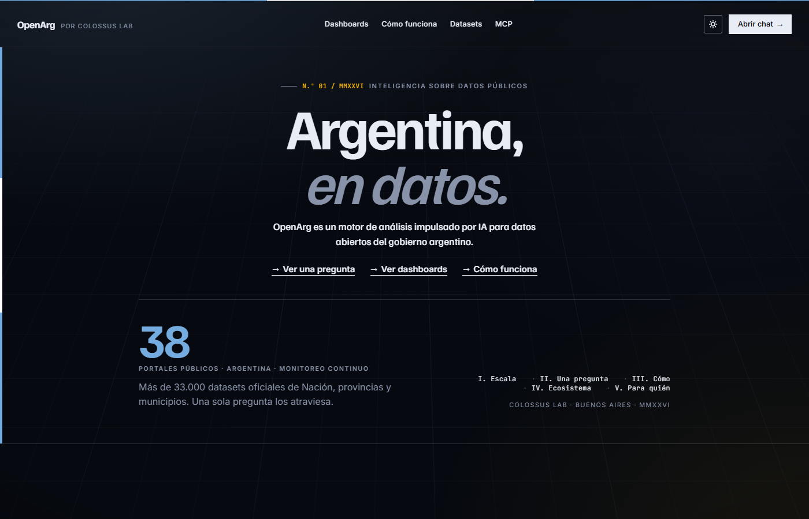
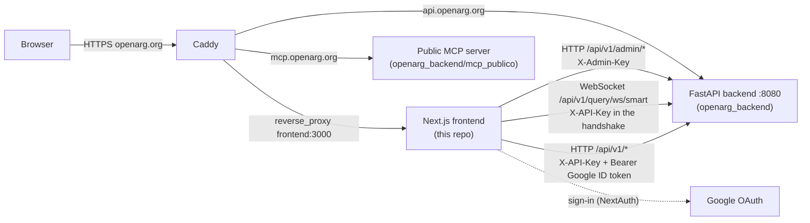

<h1 align="center">OpenArg</h1>

<p align="center">
  <b>AI-powered analysis of Argentina's open government data</b><br/>
  Ask questions in natural language. Get answers with charts, tables, and links to the official sources.
</p>

<p align="center">
  
</p>

<p align="center">
  
  
  
  
</p>

---

## Overview

This repository is the web front of OpenArg, served at [openarg.org](https://openarg.org). It is a Next.js (App Router) application with four kinds of pages:

- **Public pages**: the landing, `/como-funciona`, `/dashboards`, `/desarrolladores` and `/privacy`.
- **The chat** (`/chat`, Google sign-in required): you ask a question and the answer arrives as it is written, with the agent's steps, charts, maps and the list of sources.
- **The developer key page** (`/desarrolladores`): where people get the key for the public API and the MCP server at [mcp.openarg.org](https://mcp.openarg.org), and see their monthly usage.
- **The admin dashboard** (`/admin/mcp`, only for `ADMIN_EMAILS`): usage of the MCP and the public API, users, Founders and credits.

The frontend is a thin client. Data, search and the language model all live in the [backend](https://github.com/colossus-lab/openarg_backend) (FastAPI + Celery + PostgreSQL/pgvector). The browser never talks to the backend directly: it only calls this app's own `/api/*` route handlers, which run on the Next.js server, hold the secrets and forward the request to the backend.

> Last checked against the code: 2026-10-08.

---

## Architecture


```mermaid
flowchart LR
    B[Browser] -- "HTTPS openarg.org" --> C[Caddy]
    C -- "reverse_proxy frontend:3000" --> F["Next.js frontend<br/>(this repo)"]
    F -- "HTTP /api/v1/*<br/>X-API-Key + Bearer Google ID token" --> BE["FastAPI backend :8080<br/>(openarg_backend)"]
    F -- "WebSocket /api/v1/query/ws/smart<br/>X-API-Key in the handshake" --> BE
    F -- "HTTP /api/v1/admin/*<br/>X-Admin-Key" --> BE
    F -. "sign-in (NextAuth)" .-> G[Google OAuth]
    C -- "api.openarg.org" --> BE
    C -- "mcp.openarg.org" --> M["Public MCP server<br/>(openarg_backend/mcp_publico)"]
```

In production the frontend runs as a container on the same EC2 host as the backend, behind Caddy. The routing lives in the backend repo: [`Caddyfile`](https://github.com/colossus-lab/openarg_backend/blob/main/Caddyfile) sends `openarg.org` to `frontend:3000`, and it blocks `/api/v1/admin/*` on `api.openarg.org`. That is why the admin dashboard goes through this app's server, which reaches the backend over the internal network (`OPENARG_BACKEND_URL`).

---

## How a chat question flows

1. The chat page (`src/app/chat/page.tsx`, through the `useSSEStream` hook) sends `POST /api/chat` with the message and the conversation id. The response is a Server-Sent Events stream.
2. `src/app/api/chat/route.ts` checks the session and the per-user rate limit, caps the message length and the history, creates the conversation in the backend if it is a new one (`POST /api/v1/conversations/`) and saves the user message.
3. `src/lib/chat/wsBridge.ts` opens a WebSocket to `/api/v1/query/ws/smart`. The service key goes in the `X-API-Key` handshake header, not in the URL, so it never ends up in the backend's access log. The first message carries the question, the conversation id, the user's email and the Google ID token, which the backend checks.
4. Each backend event is translated into one or more SSE events for the browser (`src/lib/chat/eventMapper.ts`, `src/lib/chat/quota.ts`):

   | Backend (WebSocket) | Browser (SSE) |
   |---|---|
   | `status` | `phase_change` and/or `thinking` (the step text shown in the activity view) |
   | `chunk` | `content` |
   | `clear_answer` (the backend restarted the answer) | `clear_answer` |
   | `complete` | `result_meta` (confidence, warnings), `sources`, `chart`, `map`, `documents`, `quota` |
   | `clarification` | `clarification` (stored as the answer, so it reads the same when you come back) |
   | `error` with code `QUOTA_EXHAUSTED` or `WEB_DAILY_CAP` | `quota_exhausted` + `content` (shown as a notice, not an error) |
   | any other `error` | `error` |

   The bridge itself adds `conversation_saved`, `assistant_message_saved` and `done`.
5. Timeouts: 8 s to connect and 120 s without any message. If the WebSocket can't connect or drops before any text arrived, the route falls back to `POST /api/v1/query/smart` (`src/lib/chat/syncFallback.ts`) and fakes the phases so the UI looks the same. If it drops after some text arrived, the partial answer is kept and marked with an error. An explicit `error` event from the backend is passed on as is, with no fallback.
6. Success or failure, the assistant message is saved (`saveAssistantMessageWithRetry`, three attempts, with `errored: true` on failure). An errored message shows a **Regenerar** button.

Which engine writes the answer is a backend decision: `ANSWERS_ENGINE` picks between the tool-using agent (`agent`, Claude Sonnet through Bedrock) and the earlier LangGraph pipeline (`legacy`, the code default). Both emit the same events, so the frontend works the same with either one. See the [backend README](https://github.com/colossus-lab/openarg_backend#readme).

### What the chat shows

| Piece | Component | Notes |
|---|---|---|
| Agent activity | `components/chat/AgentActivity.tsx` | While it works: the current step and a seconds counter. When it finishes: a folded "thought for N s · N steps" summary. It replaced the old four-agent bar (Strategist, Researchers, Analyst, Writer). |
| Answer | `components/ChatMessage.tsx` | Markdown with GFM, sanitized with `rehype-sanitize`. Shows how many sources and portals were used. |
| Data age notice | `components/ChatMessage.tsx` | The backend's `warnings` (for example, how old the data is), shown as a quiet note under the answer. |
| Sources panel | `components/SourcePanel.tsx` | Collapsible list of `portal: dataset` links. Presigned S3 links get a download icon. |
| Charts | `components/DataChart.tsx`, `components/ObservablePlotChart.tsx` | Recharts for `line_chart`, `bar_chart` and `pie_chart`; Observable Plot for `heatmap` and `scatter`. Loaded on the client only. |
| Maps | `components/MapView.tsx` | Leaflet, for the backend's GeoJSON-style `map_data`. |
| Documents | `components/DocumentCards.tsx` | Cards for records such as asset declarations (DDJJ). |
| Feedback | `components/ChatMessage.tsx` + `hooks/useMessageFeedback.ts` | Thumbs up or down with an optional comment (`PATCH /api/feedback`). |
| Quota | `components/chat/ChatQuota.tsx` | See below. |
| History and sharing | `components/ConversationSidebar.tsx`, `components/chat/ChatComposer.tsx` | List, open and delete past conversations. Download (desktop) or share (mobile) the current one. |

### Quotas shown to the user

The backend enforces the limits; the frontend only shows them.

- **Chat** (`ChatQuota`, under the text box): questions left this month and credits. The numbers come from the backend: `/api/developers/usage` → `web` when the chat opens, then the `quota` event after each answer. The backend defaults are 30 questions a month, or 100 for Founders (`PUBLIC_WEB_MONTHLY_PREGUNTAS` and `PUBLIC_WEB_FOUNDER_PREGUNTAS` in the backend's `web_quota.py`). With no questions or credits left, the text box is disabled and the message says when the month renews (the 1st, 00:00 UTC) and, for non-Founders, links to supporting the project. A `WEB_DAILY_CAP` rejection is the backend's global daily cap for the web chat.
- **API / MCP key** (`/desarrolladores`): questions and data queries used this month against their limits, extra credits, Founder status and the renewal date. The intro text hardcodes the free tier, 10 questions and 200 data queries a month, which matches the backend defaults (`PUBLIC_API_MONTHLY_PREGUNTAS`, `PUBLIC_API_MONTHLY_DATOS`).

---

## Pages and access

`src/middleware.ts` redirects to `/login` when there is no session on `/chat`, `/datasets`, `/admin/*` and every `/api/*` route except `/api/auth/*`. Everything else is public.

| Route | Access | What it is |
|---|---|---|
| `/` | public | Editorial landing (`components/landing-ed/*`), with JSON-LD from `lib/seo.ts` |
| `/como-funciona` | public | How OpenArg works |
| `/dashboards` | public | Catalog of separate dashboards built on public data (`lib/products.ts`) |
| `/desarrolladores` | public; the key needs a session | Get, regenerate or revoke the API/MCP key; monthly usage; the `claude mcp add` command for `https://mcp.openarg.org/mcp` |
| `/privacy` | public | Privacy policy |
| `/login` | public | Google sign-in |
| `/chat` | session | The chat |
| `/datasets` | session | Dataset explorer and taxonomy (`/api/datasets`, `/api/taxonomy`) |
| `/admin/mcp` | session + `ADMIN_EMAILS` (404 for everyone else) | MCP/API usage dashboard (overview, timeline, breakdown, keys, questions, users, over 7/30/90 days), the full user list, Founders and credit top-ups |
| `/robots.txt`, `/sitemap.xml`, `/llms.txt` | public | Only `openarg.org` (and `www.`) is indexable; on any other host, staging included, `robots.txt` answers `Disallow: /` |

The user menu in the chat also covers the account itself: turning history off (which deletes past conversations and stops saving new ones), exporting your data (`/api/users/me/data`), deleting the account, and the same API key.

---

## Authentication and backend calls

- **Sign-in**: NextAuth 4 with Google (`src/lib/authOptions.ts`). It asks for offline access so the Google ID token can be refreshed with the refresh token. JWT sessions last 7 days, in an `HttpOnly` cookie (with the `__Secure-` prefix when `NEXTAUTH_URL` is `https://`).
- **Who can sign in**: only the emails in `ALLOWED_EMAILS`. If that list is empty, nobody can. With `OPEN_BETA=true` anyone can, or only the domains in `OPEN_BETA_DOMAINS` when it is set.
- **Calls to the backend** (`backendHeaders` in `src/lib/auth.ts`): `X-API-Key: OPENARG_BACKEND_API_KEY` plus `Authorization: Bearer <Google ID token>`. The token is read on the server from the encrypted NextAuth cookie (`getToken`). It is never copied into the session object the browser can read.
- **Admin calls** (`src/lib/adminBackend.ts`, `src/app/api/admin/*`): `X-Admin-Key: OPENARG_ADMIN_API_KEY`, which lives only on the server. Writes also send `X-Admin-Actor` with the admin's email, which the backend records. Each route first checks `requireAdmin`.
- **Rate limits** (`src/lib/rateLimit.ts`): in memory, per user, per minute. They reset when the container restarts. Defaults: chat 10, reads 30, writes 10, user sync 15, transparency admin actions 5, admin credit/Founder writes 20.

### Route handlers (`src/app/api`)

| Route | Backend endpoint |
|---|---|
| `POST /api/chat` | WS `/api/v1/query/ws/smart`, fallback `POST /api/v1/query/smart`, plus `/api/v1/conversations/*` |
| `GET /api/chat/suggestions` | none: reads `OPENARG_CHAT_SUGGESTIONS_JSON` |
| `/api/conversations`, `/api/conversations/[id]` | `/api/v1/conversations/*` |
| `PATCH /api/feedback` | `/api/v1/conversations/{id}/messages/{id}/feedback` |
| `/api/developers/keys`, `/api/developers/keys/[keyId]`, `/api/developers/usage` | `/api/v1/developers/*` |
| `/api/users/sync`, `/api/users/me`, `/api/users/me/settings`, `/api/users/me/data` | `/api/v1/users/*` |
| `GET /api/datasets`, `GET /api/taxonomy` | `/api/v1/datasets*`, `/api/v1/taxonomy*` |
| `/api/transparency` | `/api/v1/transparency/*` (no page uses it today) |
| `GET /api/admin/mcp/[view]` | `/api/v1/admin/analytics/mcp/{view}` |
| `/api/admin/supporters`, `POST /api/admin/credits` | `/api/v1/admin/supporters`, `/api/v1/admin/credits` |
| `GET /api/observability/chat-bridge` (admin) | none: in-process WebSocket/fallback counters |

---

## Tech Stack

| Layer | Technology |
|---|---|
| Framework | Next.js 16 (App Router, `output: 'standalone'`) |
| UI | React 19, Motion, react-icons |
| Language | TypeScript 5 |
| Markdown | react-markdown, remark-gfm, rehype-sanitize |
| Charts and maps | Recharts 3, Observable Plot, Leaflet |
| Auth | NextAuth 4 (Google OAuth) |
| Styling | Custom CSS (`src/app/globals.css`), light and dark themes, Argentina flag palette; self-hosted Inter, JetBrains Mono and Familjen Grotesk |
| Internationalization | next-intl, Spanish only (`messages/es.json`) |
| Monitoring | Sentry (`@sentry/nextjs`), on only when `NEXT_PUBLIC_SENTRY_DSN` is set |
| Testing | Vitest, Testing Library, jsdom |
| Deploy | Docker image on GHCR, run on EC2 behind Caddy |

---

## Quick Start

You need the [OpenArg backend](https://github.com/colossus-lab/openarg_backend) running. Its local `docker-compose.yaml` publishes the API on `localhost:8081`, which is this app's default `OPENARG_BACKEND_URL`. If the backend sets `BACKEND_API_KEY`, `OPENARG_BACKEND_API_KEY` must have the same value.

### Local Development

Use Node 24 (npm 11), like CI and the Dockerfile. The lockfile was generated with npm 11, and npm 10 rejects it in `npm ci`. `.nvmrc` and `engines` still say 20.

```bash
git clone https://github.com/colossus-lab/openarg_frontend.git
cd openarg_frontend
npm install
cp .env.local.example .env.local   # fill in the values
npm run dev                         # http://localhost:3000
```

Signing in needs a Google OAuth client whose authorized redirect URI is `http://localhost:3000/api/auth/callback/google`, and your email in `ALLOWED_EMAILS`. `DISABLE_AUTH=true` skips only the middleware redirect, and only outside production; the `/api/*` handlers still ask for a session.

> **Windows on ARM64:** npm can skip the optional `*-win32-arm64*` native bindings ([npm/cli#4828](https://github.com/npm/cli/issues/4828)), and then `next dev`, `next build` and `vitest` fail with "Failed to load native binding". The lockfile lists them. Install them in a single command, since a later `npm install` removes `--no-save` packages. The versions below come from `package-lock.json`; `@next/swc-*` and `@rolldown/binding-*` must match `next` and `rolldown` exactly:
>
> ```bash
> npm install --no-save @next/swc-win32-arm64-msvc@16.1.6 @rolldown/binding-win32-arm64-msvc@1.0.0-rc.11 \
>   @swc/core-win32-arm64-msvc@1.15.21 @rollup/rollup-win32-arm64-msvc@4.60.0 \
>   lightningcss-win32-arm64-msvc@1.32.0 @parcel/watcher-win32-arm64@2.5.6
> ```

### Docker

```bash
docker build -t openarg-frontend .
docker run -p 3000:3000 --env-file .env.local openarg-frontend
```

Inside the container `localhost` is the container itself, so point `OPENARG_BACKEND_URL` at the backend's address instead (for example `http://host.docker.internal:8081` on Docker Desktop). `NEXT_PUBLIC_*` values are baked into the browser bundle when `next build` runs. The Dockerfile doesn't pass any, so setting them at `docker run` doesn't change what the browser gets.

### Environment Variables

Server-side unless the name starts with `NEXT_PUBLIC_`. `.env.local.example` has the basics. The ones marked † are not in it.

| Variable | Description |
|---|---|
| `OPENARG_BACKEND_URL` | Backend base URL (default `http://localhost:8081`). The WebSocket URL is derived from it. In the production compose it is `http://backend:8080`. |
| `OPENARG_BACKEND_API_KEY` | Service key, sent as `X-API-Key` on every backend call and on the WebSocket handshake |
| `OPENARG_ADMIN_API_KEY` † | Sent as `X-Admin-Key` to `/api/v1/admin/*`. Without it the admin routes answer 503. |
| `NEXTAUTH_SECRET` | Signs and encrypts the session JWT (`openssl rand -base64 32`) |
| `NEXTAUTH_URL` | Public URL of the app. `https://` turns on secure cookies. |
| `GOOGLE_CLIENT_ID`, `GOOGLE_CLIENT_SECRET` | Google OAuth client, also used to refresh the ID token |
| `ALLOWED_EMAILS` | Comma-separated emails allowed to sign in (empty = nobody) |
| `OPEN_BETA` †, `OPEN_BETA_DOMAINS` † | `OPEN_BETA=true` lets anyone sign in, optionally limited to those domains |
| `ADMIN_EMAILS` | Comma-separated admin emails (`/admin/mcp`, admin routes) |
| `OPENARG_CHAT_SUGGESTIONS_JSON` † | JSON array of strings, up to 8, for the chat's suggestion chips. Without it the chat uses its built-in list. |
| `NEXT_PUBLIC_API_URL` † | Base URL in the `curl` example of the API key dialog (default `https://api.openarg.org`) |
| `NEXT_PUBLIC_SENTRY_DSN` † | Turns Sentry on |
| `NEXT_PUBLIC_CHAT_MIN_DISPLAY_MS` † | Minimum time before closing a very fast (cached) answer (default 2000) |
| `RATE_LIMIT_CHAT`, `RATE_LIMIT_READ`, `RATE_LIMIT_WRITE`, `RATE_LIMIT_ADMIN`, `RATE_LIMIT_SYNC` †, `RATE_LIMIT_WINDOW_MS` | Rate limits (see above) and their window (default 60000 ms) |
| `MAX_MESSAGE_LENGTH`, `MAX_HISTORY_CONTENT`, `MAX_HISTORY_LENGTH` | Chat input caps (defaults 5000 characters, 2000 characters per history item, 20 items) |
| `DISABLE_AUTH` † | `true` skips the middleware redirect in development; ignored in production |

### Available Scripts

```bash
npm run dev          # Dev server (port 3000)
npm run build        # Production build (standalone)
npm run start        # Serve the build
npm run lint         # ESLint
npx tsc --noEmit     # Type check (in CI, the check that blocks the image build)
npm run test         # Vitest, once
npm run test:watch   # Vitest in watch mode
```

Tests live in `tests/` (`components/`, `lib/`, `unit/`) and run in jsdom. They cover the WebSocket bridge, the HTTP fallback, event mapping and validation, the SSE hook, the quota indicator, the admin proxies and dashboard, and the `/desarrolladores` page.

---

## Deploy

**CI** (`.github/workflows/ci.yml`) runs on pushes and PRs to `main` and `staging`, but only when one of these changes: `src/**`, `tests/**`, `package.json`, `package-lock.json`, `tsconfig.json` or `.github/workflows/**`.

1. **Lint & Test** (Node 24): `npm ci`, lint, `tsc --noEmit` and Vitest. Lint and tests are `continue-on-error`, so only the type check can stop the build.
2. **Build & Push** (pushes only): builds the `Dockerfile` (standalone Next.js on `node:24-alpine`, port 3000) and pushes `ghcr.io/colossus-lab/openarg/openarg-frontend` tagged with the branch name (`:staging` or `:main`). A push to `main` also tags `:latest`.

Things that follow from this:

- **Production runs `:latest`, and only `main` publishes it.** Merging to `staging` doesn't change production.
- **There is no `:sha-*` tag for the frontend**, unlike the backend. The only way back is to retag the running image on the server before deploying. The backend's [production deploy guide](https://github.com/colossus-lab/openarg_backend/blob/main/docs/deploy-produccion.md) does this for the `openarg_frontend` container too.
- **A change only outside those paths doesn't build an image**: for example `messages/` (UI strings), `public/`, `docs/`, `specs/`, `next.config.ts`, the `Dockerfile` or this README. It ships with the next build triggered by one of the watched paths.

**Release** is manual on the server: pull the new image and recreate the service (`docker compose pull frontend && docker compose up -d --no-deps frontend`). Then run the backend's [`scripts/verify_deploy.sh`](https://github.com/colossus-lab/openarg_backend/blob/main/scripts/verify_deploy.sh): it compares each `openarg_*` container's running image with the image its tag points to, `openarg_frontend` included. The reference service definition is in the backend's [`docker-compose.prod.yml`](https://github.com/colossus-lab/openarg_backend/blob/main/docker-compose.prod.yml) (`frontend`, image tag from `OPENARG_IMAGE_TAG`, default `latest`). The servers keep their own copy of the compose file.

openarg.org is served by this container behind Caddy, not by Vercel. The repo has no Vercel configuration; `.vercel` only appears in `.gitignore`. Some of the external dashboards listed on `/dashboards` are hosted on Vercel.

---

## Project Structure

```
src/
├── app/
│   ├── page.tsx                  # Editorial landing
│   ├── chat/page.tsx             # Chat (SSE consumer)
│   ├── desarrolladores/          # API/MCP key + monthly usage (public page)
│   ├── admin/mcp/page.tsx        # Admin dashboard (ADMIN_EMAILS, 404 otherwise)
│   ├── datasets/page.tsx         # Dataset explorer
│   ├── dashboards/  como-funciona/  privacy/  login/
│   ├── robots.ts  sitemap.ts     # Indexable only on openarg.org
│   ├── layout.tsx                # Fonts, theme, NextAuth + next-intl providers
│   └── api/
│       ├── auth/[...nextauth]/   # NextAuth (Google)
│       ├── chat/                 # SSE ↔ WebSocket bridge (+ suggestions/)
│       ├── conversations/  feedback/  users/  developers/
│       ├── datasets/  taxonomy/  transparency/
│       ├── admin/                # mcp/[view], supporters, credits
│       └── observability/        # chat-bridge counters (admin)
├── components/
│   ├── chat/                     # AgentActivity, ChatComposer, ChatQuota, ChatWelcome, MessageHistory
│   ├── admin/                    # AdminMcpDashboard, AdminUsers, AdminSupporters
│   ├── landing-ed/               # Editorial landing sections
│   ├── reactbits/                # Animation primitives
│   ├── ChatMessage.tsx  SourcePanel.tsx  DataChart.tsx  ObservablePlotChart.tsx
│   ├── MapView.tsx  DocumentCards.tsx  ConversationSidebar.tsx  UserMenu.tsx  ...
├── hooks/                        # useSSEStream, useStreamEventHandler, useChatQuota, useConversationState, ...
├── lib/
│   ├── chat/                     # wsBridge, syncFallback, eventMapper, eventSchemas, quota, conversationService, ...
│   ├── auth.ts  authOptions.ts   # Session, admin check, backend headers / NextAuth config
│   ├── adminBackend.ts           # X-Admin-Key calls
│   ├── rateLimit.ts  seo.ts  products.ts  types.ts  logger.ts
├── i18n/request.ts               # next-intl (locale fixed to es)
└── middleware.ts                 # Session gate
messages/es.json                  # UI strings
tests/                            # Vitest
specs/                            # Spec-Driven Design docs
scripts/, data/                   # Legacy one-off ingestion scripts (Firestore/Supabase); the app doesn't use them
```

---

## Spec-Driven Design

This repo is documented using a reverse-SDD approach (inspired by [GitHub Spec Kit](https://github.com/github/spec-kit)): every module has a `spec.md` (what the code does and why) and a `plan.md` (how it is implemented). Specs live under [`specs/`](specs/).

| Entry point | Description |
|---|---|
| [`specs/README.md`](specs/README.md) | Index of the 17 module specs |
| [`specs/constitution.md`](specs/constitution.md) | Non-negotiable principles (thin client, SSE-only bridge, NextAuth gate, etc.) |
| [`specs/000-architecture/`](specs/000-architecture/) | Macro architecture, routing, env inventory |
| [`specs/001-chat-bridge/`](specs/001-chat-bridge/) | The SSE ↔ WebSocket bridge, the most critical module |
| [`specs/002-chat-ui/`](specs/002-chat-ui/) | Chat page, streaming UI, typewriter reveal |
| [`specs/004-auth/`](specs/004-auth/) | NextAuth + allowlist + middleware gate |

> The specs were last synced with the code in April 2026 (see the `Last synced with code` line at the top of each one). Some describe the earlier UI (for example the `AgentActivityBar`, since replaced by `AgentActivity`), and none covers the admin dashboard, the monthly quota or the public `/desarrolladores` page. Until they are updated, the code is the reference.

---

## Known gaps

- `/como-funciona` and the landing's pipeline section (`components/landing-ed/PipelineEditorial.tsx`) still describe the earlier four-agent pipeline. `/como-funciona` also says thirty-two portals, while `lib/seo.ts` says 38.
- `DataQualitySection`, `IntraRanking` and `DigitalizationGuide` in `src/components/` aren't imported anywhere, and `/api/transparency` has no page.
- `.env.local.example` lacks the variables marked † above.

---

## Related Documentation

Backend repository:

| Document | Description |
|---|---|
| [README](https://github.com/colossus-lab/openarg_backend#readme) | Backend overview |
| [docs/](https://github.com/colossus-lab/openarg_backend/tree/main/docs) | Documentation index |
| [API Reference](https://github.com/colossus-lab/openarg_backend/blob/main/docs/api-reference.md) | Backend REST API endpoints |
| [Deployment](https://github.com/colossus-lab/openarg_backend/blob/main/docs/deployment.md) | Containers and local environment |
| [Production deploy](https://github.com/colossus-lab/openarg_backend/blob/main/docs/deploy-produccion.md) | Promotion, retag before deploying, rollback, `verify_deploy.sh` |
| [Runbook](https://github.com/colossus-lab/openarg_backend/blob/main/docs/runbook.md) | Incident response |
| [Caddyfile](https://github.com/colossus-lab/openarg_backend/blob/main/Caddyfile) | Routing for openarg.org, api.openarg.org and mcp.openarg.org |

---

## Contributing

We welcome contributions! Please read our guidelines before getting started:

- [**Contributing Guide**](CONTRIBUTING.md): setup, workflow, PR process and coding standards
- [**Code of Conduct**](CODE_OF_CONDUCT.md): expected behavior and community standards
- [**Security Policy**](SECURITY.md): how to report vulnerabilities responsibly

### Spec-Driven Design is the contract

This project uses **Spec-Driven Design** (see the [Spec-Driven Design section](#spec-driven-design) above). Before opening a PR that adds, removes or changes observable behavior:

1. **Read the affected `spec.md` + `plan.md`** under [`specs/`](specs/) to understand the current design and constraints. If there is a `[NEEDS CLARIFICATION]` or `[DEBT]` entry related to your change, reference it in the PR.
2. **Update the spec as part of your PR.** If code and spec diverge, the PR is incomplete. Add or update `FR-NNN`, `DEBT-NNN` or `CL-NNN` entries as appropriate, and bump the `Last synced with code` date at the top of the spec.
3. **If you introduce new invariants** (timeouts, auth rules, event contracts, component behavior), add them to the relevant [`constitution.md`](specs/constitution.md) or module spec so future contributors inherit the context.
4. **Reviewers will check both the code and the spec.** PRs that change behavior without spec updates will be asked to fix the drift before merging.

For net-new features, prefer creating a new `specs/NNN-feature/` folder with `spec.md` (WHAT/WHY) + `plan.md` (HOW) before writing code, following the structure of the existing modules.

### Quick steps

1. Fork the repository
2. Create a feature branch (`git checkout -b feature/my-feature`)
3. Read and update the relevant specs under [`specs/`](specs/) alongside your code changes
4. Run `npm run lint && npx tsc --noEmit && npm run test`
5. Open a pull request against `staging`. The repo includes PR and issue templates to guide you.

Please open an issue first for major changes to discuss the approach.

---

## License

[MIT](LICENSE)

---

<p align="center">
  <br/>
  Created by <b>Luciano Carreno</b> & <b>Dante De Agostino</b><br/>
  <a href="https://github.com/colossus-lab"><b>ColossusLab</b></a>
</p>
